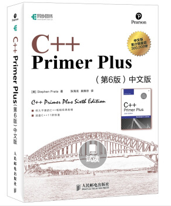
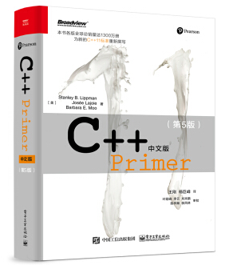

# C++ 

专业：计算机类、信息专业全体；  

时间：大一下；  

讲师：徐艳艳、王春玲、王少荣等；  

---

## 授课教材  

《C++ Primer》、《C++ Primer Plus》5-6th，**不建议一上来就抱着大部头啃，等于劝退！**；    

    

    

二者的区别，引用豆瓣用户书评：  

> 《Plus》可以说是一本面向从未学习过C语言甚至是从未学习过编程的人的入门书籍，它的第一章从基础内容讲起，先介绍了传统编程的规则，后面才着重讲解有关面向对象——C++的精髓之一——的有关内容。整个书的结构安排较为合理，难度爬升较慢。  
>
> 而《C++ Primer》我认为是一本针对有编程基础（尤其是C基础）的读者的。我只看过PDF版本，其第一章就已经涉及到了一些抽象的概念，不利于初学者接触。这也正是我力荐这本书的缘故。

推荐C语言基础不错的(期末85分+)同学，直接买 Primer，当然电子版也行。   

这两本书的电子版因版权原因，在计协FTP服务器：`ftp://202.204.121.93/计算机教学资料/` Book书目录中。   

---

## 课程评价

C++ 本身比 C 语言在语法上更复杂，所以更加难学，而且相较初学编程时的C语言老师们，C++老师讲课时会忽略一些细节，所以需要自己在练习方面比入门C语言时多花一些功夫。

知识点：C++ 基本语法、数据结构(struct等)、C++ 类 & 对象、继承、重载运算符和重载函数、多态、数据抽象、数据封装、接口（抽象类）、文件和流、动态内存、C++ 模板 、C++ STL 教程 等等。   

**考试：** 上机考试，基本上就是上面的知识点内容。   

## 自学方法

推荐学习顺序：入门视频 + 随视频练习 --> 看书 + 书后有水平的练习题 --> 视频或书上的实战入门小项目； 

### 入门视频

* 中国大学Mooc  [C++程序设计 国家精品 西北工业大学 魏英](https://www.icourse163.org/course/NWPU-494001) : 离线版在计协FTP 计算机教学资料 视频目录中，C语言基础好的，建议从第 20讲开始看；  
* 学堂在线  [C++语言程序设计基础 国家精品 清华大学 郑莉等](http://www.xuetangx.com/courses/course-v1:TsinghuaX+00740043X_2015_T2+sp/about) 和 [C++语言程序设计进阶 国家精品 清华大学 郑莉等](http://www.xuetangx.com/courses/course-v1:TsinghuaX+00740043_2x_2015_T2+sp/about) ，该课有随堂模式，这里的链接都是自主模式的，建议选择随堂模式。  
* 慕课网  [C++ 远征系列](https://www.imooc.com/course/list?c=cplusplus&sort=pop)   

### 书籍推荐

* 《C++ Primer》、《Effective C++》经典工具类书；   
* 《STL源码剖析》，很老的书，很多内容都过时来了，比如空间配置器，但由于面试官还是会问……所以写在这里了；   
* 《深度探索C++对象模型》，重点是虚函数的实现，建议多看几遍。
* 《Effective C++:改善程序与设计的55个具体做法》、《More Effective C++》，建议挑着快速浏览一遍；  

### 入门练手  

* 书中一些章节后的小项目；  
* [牛客网 C/C++ 专项练习](https://www.nowcoder.com/intelligentTest)  
* [实验楼免费项目](https://www.shiyanlou.com/courses/?category=all&course_type=all&fee=free&tag=C%2B%2B&unfold=0) 包括：C++11/14快速上手、C++ 实现 STL 标准库和算法、C++ 实现俄罗斯方块、C++ 解决迷宫问题、C++ 使用 openGL 实现吃豆人游戏等；  
* [RosettaCode C++](http://rosettacode.org/wiki/Category:C++)：rosettacode 上的各种 C++ 代码实现；   
* [B 站 C++ 实战类视频](https://search.bilibili.com/all?keyword=C%2B%2B%20%E5%AE%9E%E6%88%98)  

## C++ 相关资料

* [C++ tutorials](http://www.cplusplus.com/doc/tutorial/)   
* [C++ reference](http://www.cplusplus.com/reference/)  
* [C++ 菜鸟教程](http://www.runoob.com/cplusplus/cpp-tutorial.html)  
* [C++ w3schools](https://www.w3schools.in/cplusplus-tutorial/)  
* [知乎：《C++ Primer》和《C++ Primer Plus》有哪些区别？](https://www.zhihu.com/question/21188013)   
* [牛客网：C++ 教材全解](https://www.nowcoder.com/schoolbooks?type=2)   

